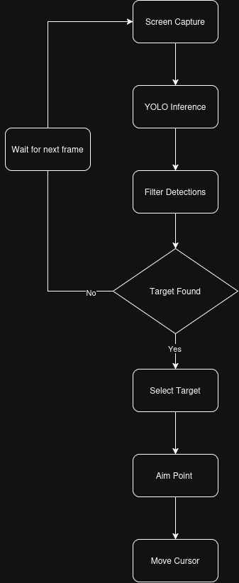

# Image Detection In The Aimbot Program Using YOLOV4-TINY

- Uses image detection software in FPS (first-person shooter) games to detect an enemy on screen, if detected an input signal is sent to the device to move the cursor over the enemy.

- Python is used for most aimbot applications due to the YOLO algorithm being developed in it.

- YOLO (You Only Look Once) algorithm uses end-to-end neural networks that makes predictions of bounding boxes. The YOLO algorithm takes an image as input and then uses a simple deep convolutional neural network to detect objects in the image.

## Flow and Optimisations

- The aimbot program used in this paper also used a CSPBlock (Cross Stage Partial Block). This means instead of going through all convolution layers and perhaps learning on duplicate data, the CSP splits, processes and merges the input to optimise the model.

- To reduce redundancy in the prediction process, a  confidence  threshold  is  created.  If  the  confidence value of a bounding box is greater than the confidence threshold, the bounding box will be saved

- Most aimbot applications follow this flow chart:  

    

## Results from the paper:
- The average percentage of detection  success  obtained  from  5  different  maps  is 50.56%.
- Difficulty recognising enemies at a distance due to blurry images.
- Difficult to distinguish between enemy textures and map textures in certain maps.
- Lighting greatly affected detection. Some maps have poor lighting conditions which resulted in inaccurate detection.
- The rifle held by the player was identified a seperate player and tried to shoot the user's character.
- A decrease  in  performance  when  detecting more  than  1  opponent.  This  is  because  the  non-maximal  suppression  (NMS)  process  used  when  the program  detects  an  object  really  drains  a  lot  of computer  performance,which  results  in  decreased detection speed.

## Conclusion:

- **Heavy hardware requirements to run.**
    - (Paper used a IdeaPadS340 model with an AMD Ryzen 5 3500U Processor with a Radeon Vega Mobile Gfx 2.10 GHz GPU which has a RAM size of 8GB - Game was not computationally intense)
- **Optimization can be done by creating a dataset specifically for detecting human objects**
    - This is required to minimise the ammount of errors when the program confuses objects or map textures with enemies.
- **Applying the non-maximum suppression process to speed up the image processing when an enemy is detected and create a system to distinguish friend and foe so that incidents of shooting teammates can be avoided**

---

### Source
[Image Detection In The Aimbot Program Using YOLOV4-TINY](https://jutif.if.unsoed.ac.id/index.php/jurnal/article/view/821) (2023)