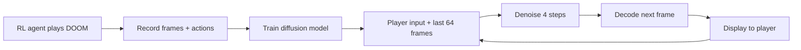

# Diffusion Models Are Real-Time Game Engines (GameNGen)

- GameNGen is a game engine run entirely by a neural network. There is no traditional game code while it is running: the model predicts every frame of DOOM from what happened before and what the player is pressing.

- It is built on top of Stable Diffusion v1.4, a pre-trained text-to-image diffusion model. It was re-trained to generate the next game frame instead of an image from a text prompt.

- A diffusion model learns to generate images by starting from random noise and slowly "denoising" it until a clear image is left. Here the model is conditioned on the past frames and the player's actions, so the image it generates is the next frame of the game.

## Flow and Optimisations

- **Training happens in two phases:**
    - **Phase 1 - Data collection:** A reinforcement learning (RL) agent is trained with PPO to play DOOM. Every frame and action from its training is recorded, from random play at the start to skilled play by the end. This gave a variety of gameplay to learn from (70 million examples in total).
    - **Phase 2 - Diffusion model training:** The diffusion model is trained on these recordings to predict the next frame from the previous frames and actions.

- **Actions and frames as input:** Each player action (move, shoot, etc.) is turned into a learned embedding (a token), which replaces the text prompt normally used by Stable Diffusion. The past 64 frames (about 3.2 seconds) are encoded into latent space and stacked together as context.

- **Noise augmentation:** Because the model uses its own generated frames as input for the next frame, small errors build up over time (auto-regressive drift). Without a fix, quality broke down after 20-30 frames. To solve this, random Gaussian noise is added to the context frames during training so the model learns to correct errors instead of copying them.

- **Decoder fine-tuning:** The auto-encoder's decoder was fine-tuned on DOOM frames to fix small details like the HUD numbers, which were blurry with the default decoder.

- **Fewer sampling steps:** Only 4 denoising (DDIM) steps are used per frame instead of the usual 20+, with no noticeable loss in quality. This is what makes real-time speed possible.

- Flow of the system:

## Results from the paper:
- Runs at **20 frames per second** on a single TPU.
- Next-frame prediction reached a PSNR of 29.4, similar to lossy JPEG compression quality.
- In a human study, 10 raters were shown short clips (1.6s and 3.2s) of the real game and the simulation side by side. They only picked the real game **58-60%** of the time, not much better than a random guess (50%).
- After 5-10 minutes of play, raters picking the real game dropped to **50%**, pure chance.
- Quality improved as the dataset size increased (tested at 1M, 5M, 10M and 70M examples).
- The model is able to update health, ammo, enemy attacks, doors opening, and damage consistently, logic that would normally be written in code.

## Conclusion:

- **Very limited memory.**
    - The model only sees just over 3 seconds of history, so it can forget parts of the level or game state that it hasn't seen recently.
- **Dependent on the RL agent's gameplay.**
    - The agent never explored every location in the game, so the model can behave incorrectly in areas it wasn't trained on. The agent also doesn't play the same way as a human.
- **Cannot easily make new games.**
    - GameNGen only simulates an existing game (DOOM). Making a brand new game this way is still an open problem.
- **Heavy hardware requirements to run.**
    - Needs a TPU to hit 20 FPS, compared to the original DOOM which ran on 1993 computers.
- **Shows a possible future where games are "weights of a neural model" instead of lines of code.**
    - Relevant to XAI as the game's logic is hidden inside a neural network. It is hard to explain *why* the model generated a certain frame, or to debug it like normal game code.

---

### Source
[Diffusion Models Are Real-Time Game Engines] https://arxiv.org/pdf/2408.14837
